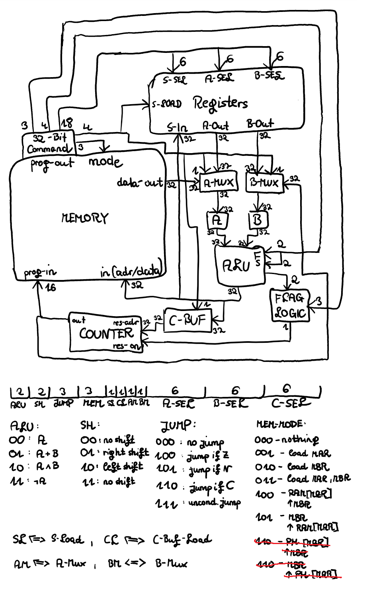

  

This is a simulation of a 32-bit van-neumann-architecture microprocessor, as conceptualized in the micro32.png

It has 64 registers, where register 0 is always 0, register 1 is always 1 and register 255 is always -1 (in two's complement).  
Only registers 2 to 8 will be printed during the programs execution, but you can easily modify the code to print all of them, by tweaking the for-loop in the printStatus-method.

8 different operations are available for the ALU, as well as 8 control-options. (more are coming, e.g. incrementing/decrementing a stack pointer)  
Look at micro32.png for more informations about the operations/options.

The memory consists of 2^16 addresses, which can be utilized for and modified by binary instructions.  
This can be done, by filling the MBR (memory-buffer-register) and MAR (memory-address-register) and then using the appropriate command (look below) to save the data from the MBR to the MAR-address or conversely load the data from the MAR-address to the MBR.

The JR (jump-register) can be loaded and conditional or nonconditional jumps utilized for jumping to the address contained in it.  
Also, the current address of the counter can be saved by setting the AMUX. 

To run a program, one must create a file called "bootloader" which may consist only of 32-bit-codes, meaning every line shall contain exactly 32 characters of either 0 or 1.  
3 bit: ALU   
1 bit: AMUX  
4 bit: CONTROL   
8 bit: A-SEL   
8 bit: B-SEL  
8 bit: S-SEL

You can also add empty lines (without any trailing space characters) or comments starting with # to your program.   
The bits specified in those 32 characters have the following effects (order from left to right) ..  
  
The bootloader-file in the repository contains an example-program, that initializes reg3=8, reg4=6 and then uses a multiplication subroutine to multiply them.   

if the command 0 is used, the program will exit.
